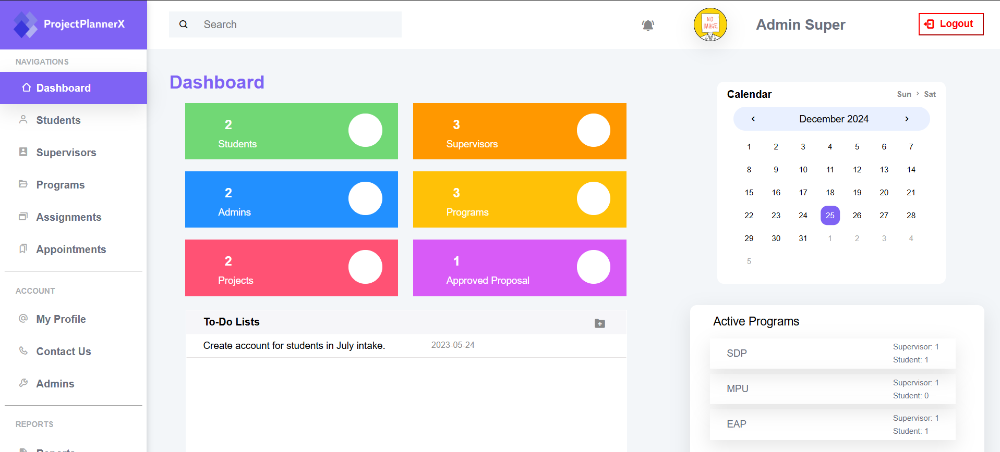
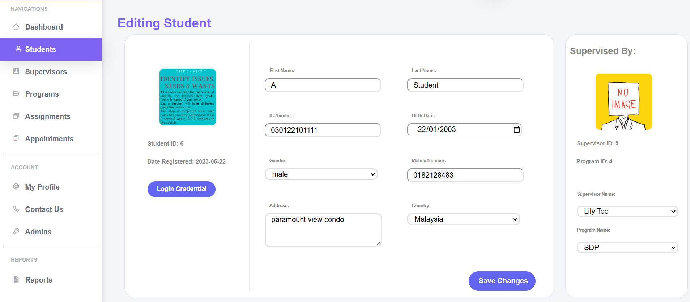
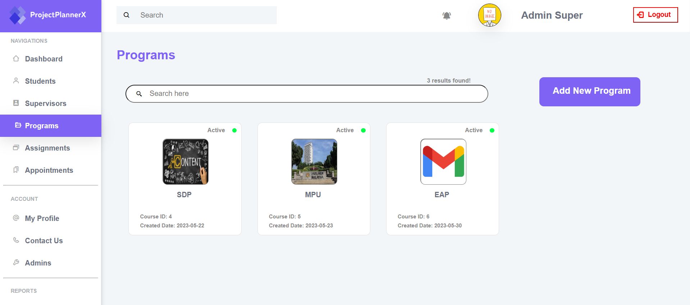
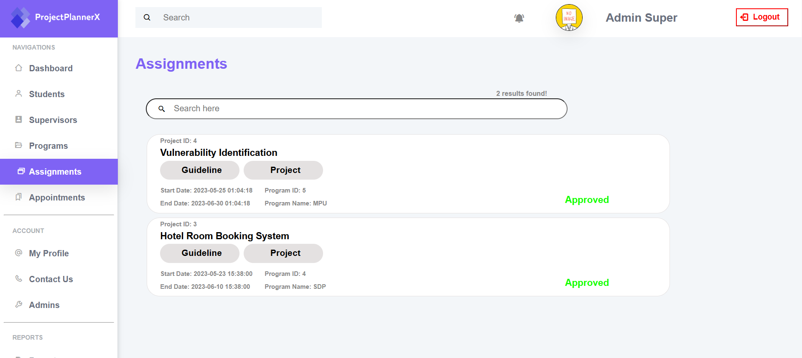
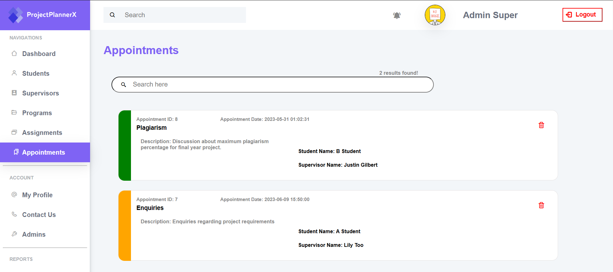
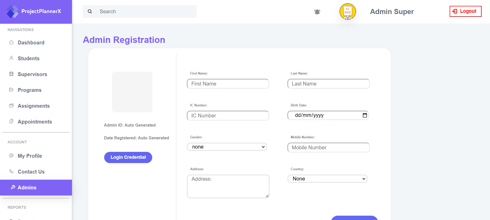
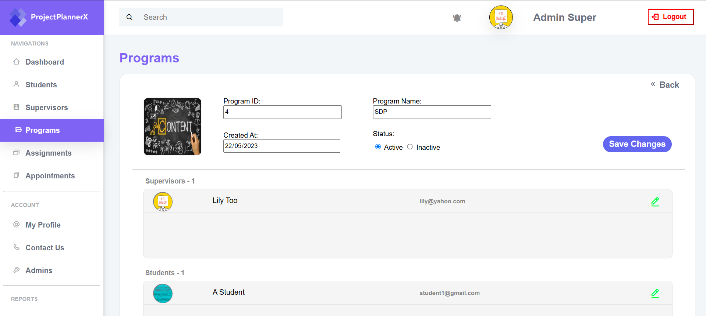
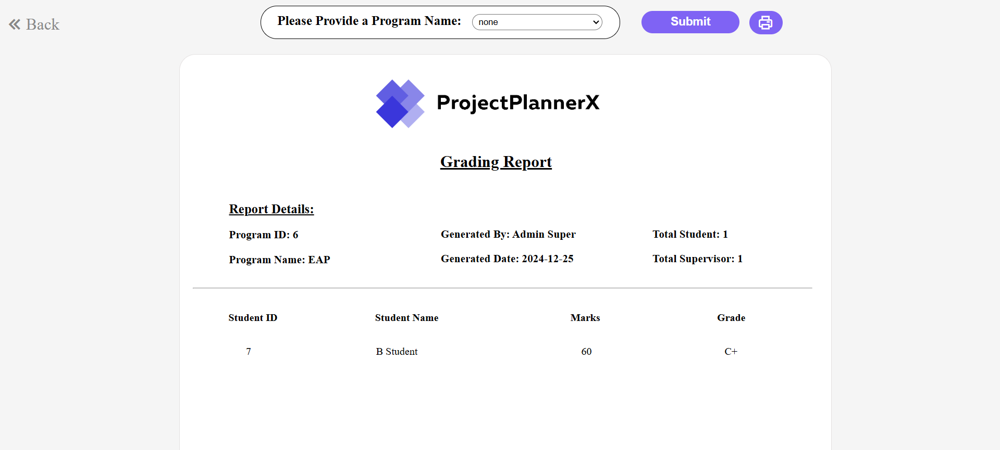
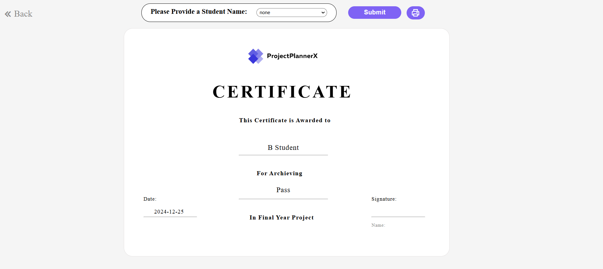

# ProjectPlannerX

University Project Management System (HTML,CSS,JavaScript,MySQL,PHP) - Admin Section.

## Functionalities
- Authentication
- CRUD on User Information
- CRUD on Appointment Information
- CRUD on Class Information
- Review Submission Tasks
- Approving Project Requests
- Notification
- TodoList CRUD 
- Report & Certificate Generation

## Requirements
- PHP >= 8.2.X
- MySQL / PhpMyAdmin
- XAMPP

## UI Showcase
          

## Setup
Step 1:
```bash
https://github.com/Sjiaseng/ProjectPlannerX.git
```

Step 2:

Place the Cloned Folder Under htdocs (XAMPP) or www (WAMP) and Start Apache and MySQL Services.

Step 3:

Head to the PhpMyAdmin Interface / MySQL Create a Database Named "sdp".

Step 4:

Import sdp.sql into the Generated Database. Enter your Credentials in the conn.php. 

Step 5:

Obtain Login Credentials from Database and Login into the System.


